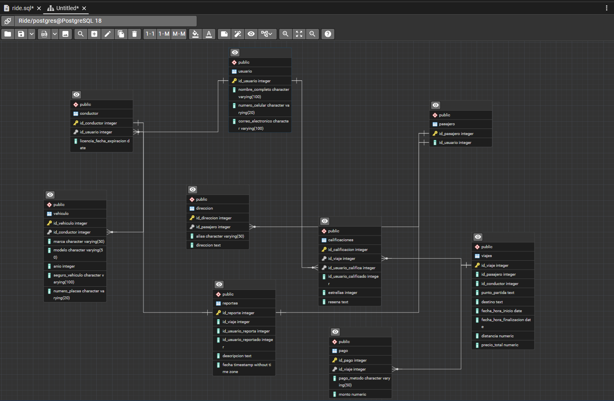
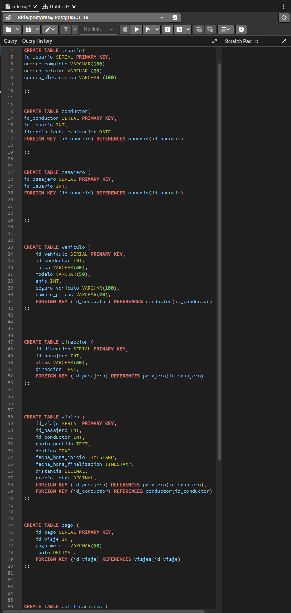

# 🚗 Proyecto SQL: Sistema de Gestión de Viajes (Ride-Share)

Diseño de base de datos relacional para una plataforma de movilidad urbana.

---

## 📊 Modelo Entidad-Relación
El siguiente diagrama muestra la arquitectura de las tablas y sus relaciones (Usuarios, Conductores, Viajes, etc.):

---

## 💻 Implementación en pgAdmin
Vista previa del código DDL utilizado para la creación de la estructura:

---

## 📂 Cómo ejecutarlo
1. Descarga el archivo `.sql` de este repositorio.
2. En pgAdmin, crea una nueva base de datos.
3. Abre el **Query Tool** y pega el contenido del archivo para generar las tablas.

---
**Desarrollado por Monica Trinidad**  
*Estudiante de Ingeniería de Software*
